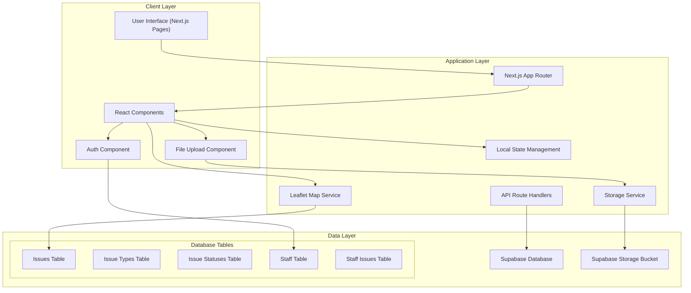

```mermaid
graph TB
    subgraph ClientLayer["Client Layer"]
        UI["User Interface (Next.js Pages)"]
        Components["React Components"]
        Auth["Auth Component"]
        FileUpload["File Upload Component"]
    end

    subgraph AppLayer["Application Layer"]
        Router["Next.js App Router"]
        APIHandlers["API Route Handlers"]
        StateManagement["Local State Management"]
        MapService["Leaflet Map Service"]
        StorageService["Storage Service"]
    end

    subgraph DataLayer["Data Layer"]
        Supabase["Supabase Database"]
        subgraph Tables["Database Tables"]
            Issues["Issues Table"]
            IssueTypes["Issue Types Table"]
            IssueStatuses["Issue Statuses Table"]
            Staff["Staff Table"]
            StaffIssues["Staff Issues Table"]
        end
        BucketStorage["Supabase Storage Bucket"]
    end

    UI --> Router
    Router --> Components
    Components --> StateManagement
    Components --> MapService
    Components --> Auth
    Components --> FileUpload
    FileUpload --> StorageService
    StorageService --> BucketStorage
    APIHandlers --> Supabase
    MapService --> Issues
    Auth --> Staff
```
