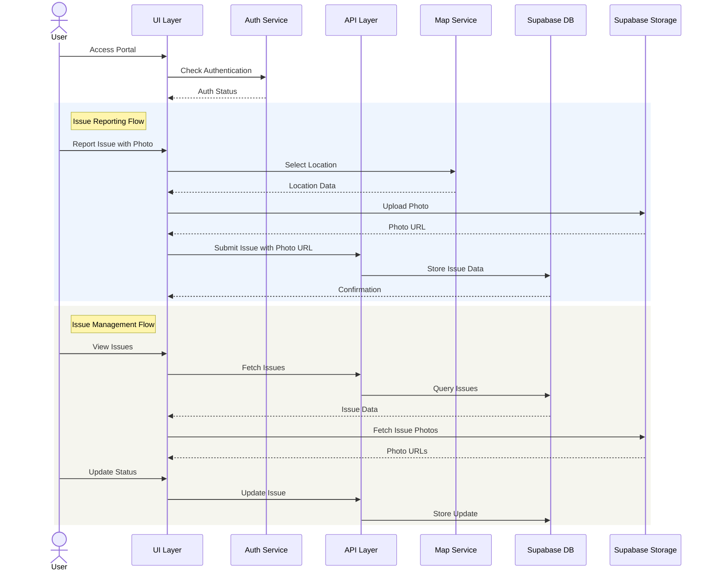

```mermaid
sequenceDiagram
    actor U as User
    participant UI as UI Layer
    participant Auth as Auth Service
    participant API as API Layer
    participant Map as Map Service
    participant DB as Supabase DB
    participant Storage as Supabase Storage

    U->>UI: Access Portal
    UI->>Auth: Check Authentication
    Auth-->>UI: Auth Status

    rect rgba(200, 220, 250, 0.3)
        Note right of U: Issue Reporting Flow
        U->>UI: Report Issue with Photo
        UI->>Map: Select Location
        Map-->>UI: Location Data
        UI->>Storage: Upload Photo
        Storage-->>UI: Photo URL
        UI->>API: Submit Issue with Photo URL
        API->>DB: Store Issue Data
        DB-->>UI: Confirmation
    end

    rect rgba(220, 220, 200, 0.3)
        Note right of U: Issue Management Flow
        U->>UI: View Issues
        UI->>API: Fetch Issues
        API->>DB: Query Issues
        DB-->>UI: Issue Data
        UI->>Storage: Fetch Issue Photos
        Storage-->>UI: Photo URLs
        U->>UI: Update Status
        UI->>API: Update Issue
        API->>DB: Store Update
    end
```
