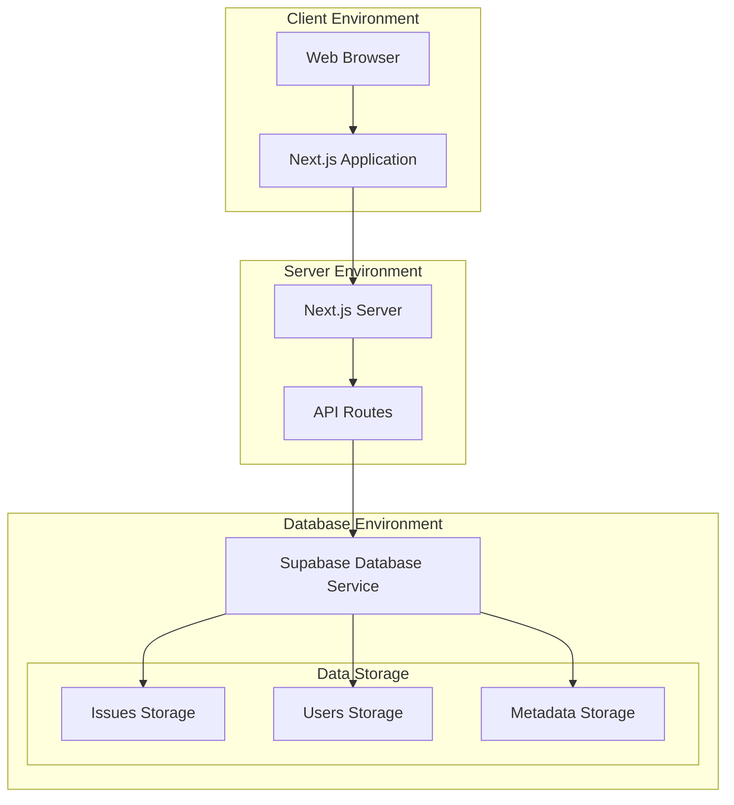

```mermaid
graph TD
    subgraph ClientEnv["Client Environment"]
        Browser["Web Browser"]
        ReactApp["Next.js Application"]
    end

    subgraph ServerEnv["Server Environment"]
        NextServer["Next.js Server"]
        APIRoutes["API Routes"]
    end

    subgraph DBEnv["Database Environment"]
        SupabaseDB["Supabase Database Service"]
        subgraph Storage["Data Storage"]
            IssuesDB["Issues Storage"]
            UsersDB["Users Storage"]
            MetadataDB["Metadata Storage"]
        end
    end

    Browser --> ReactApp
    ReactApp --> NextServer
    NextServer --> APIRoutes
    APIRoutes --> SupabaseDB
    SupabaseDB --> IssuesDB
    SupabaseDB --> UsersDB
    SupabaseDB --> MetadataDB
```
