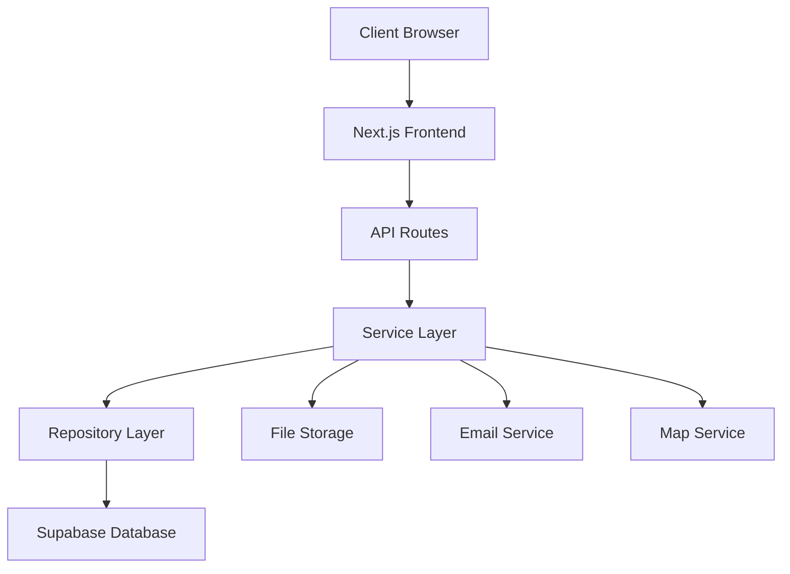

```mermaid
graph TD
    A[Client Browser] --> B[Next.js Frontend]
    B --> C[API Routes]
    C --> D[Service Layer]
    D --> E[Repository Layer]
    E --> F[Supabase Database]
    D --> G[File Storage]
    D --> H[Email Service]
    D --> I[Map Service]
```
