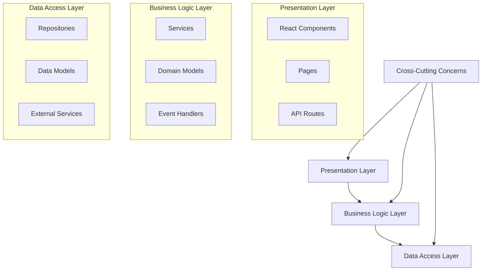

```mermaid
graph TD
    A[Presentation Layer] --> B[Business Logic Layer]
    B --> C[Data Access Layer]
    D[Cross-Cutting Concerns] --> A
    D --> B
    D --> C
    subgraph "Presentation Layer"
        A1[React Components]
        A2[Pages]
        A3[API Routes]
    end
    subgraph "Business Logic Layer"
        B1[Services]
        B2[Domain Models]
        B3[Event Handlers]
    end
    subgraph "Data Access Layer"
        C1[Repositories]
        C2[Data Models]
        C3[External Services]
    end
```
