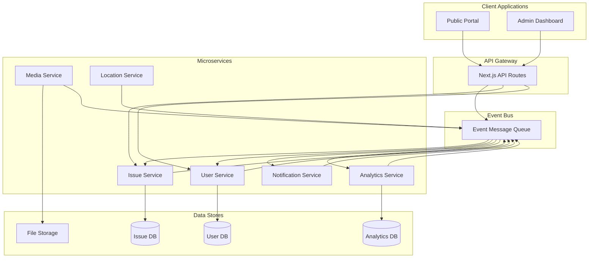

```mermaid
graph TB
    subgraph "Client Applications"
        C1[Public Portal]
        C2[Admin Dashboard]
    end

    subgraph "API Gateway"
        AG[Next.js API Routes]
    end

    subgraph "Event Bus"
        EB[Event Message Queue]
    end

    subgraph "Microservices"
        direction TB
        MS1[Issue Service]
        MS2[User Service]
        MS3[Notification Service]
        MS4[Analytics Service]
        MS5[Media Service]
        MS6[Location Service]
    end

    subgraph "Data Stores"
        D1[(Issue DB)]
        D2[(User DB)]
        D3[(Analytics DB)]
        D4[File Storage]
    end

    C1 --> AG
    C2 --> AG
    AG --> EB
    AG --> MS1
    AG --> MS2
    
    EB --> MS1
    EB --> MS2
    EB --> MS3
    EB --> MS4
    
    MS1 --> D1
    MS2 --> D2
    MS4 --> D3
    MS5 --> D4
    
    MS1 --> EB
    MS2 --> EB
    MS3 --> EB
    MS4 --> EB
    MS5 --> EB
    MS6 --> EB
```
