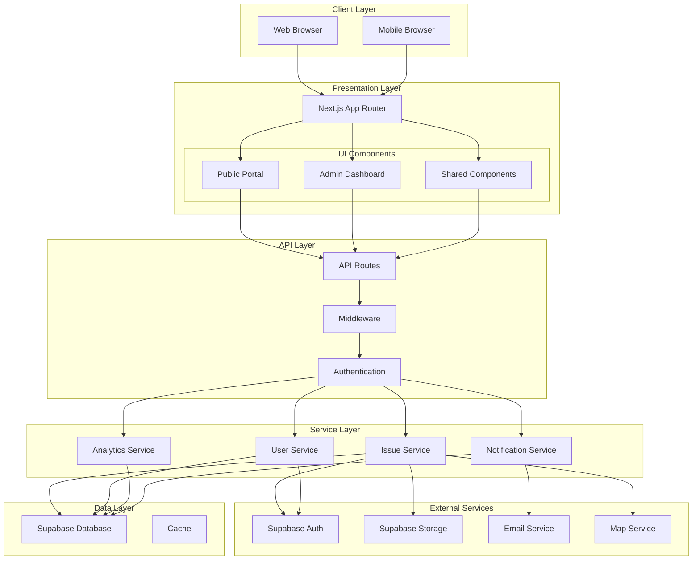

```mermaid
graph TB
    subgraph "Client Layer"
        B[Web Browser]
        M[Mobile Browser]
    end

    subgraph "Presentation Layer"
        N[Next.js App Router]
        subgraph "UI Components"
            C1[Public Portal]
            C2[Admin Dashboard]
            C3[Shared Components]
        end
    end

    subgraph "API Layer"
        A1[API Routes]
        A2[Middleware]
        A3[Authentication]
    end

    subgraph "Service Layer"
        S1[Issue Service]
        S2[User Service]
        S3[Analytics Service]
        S4[Notification Service]
    end

    subgraph "External Services"
        E1[Supabase Auth]
        E2[Supabase Storage]
        E3[Email Service]
        E4[Map Service]
    end

    subgraph "Data Layer"
        D1[Supabase Database]
        D2[Cache]
    end

    B --> N
    M --> N
    N --> C1
    N --> C2
    N --> C3
    C1 --> A1
    C2 --> A1
    C3 --> A1
    A1 --> A2
    A2 --> A3
    A3 --> S1
    A3 --> S2
    A3 --> S3
    A3 --> S4
    S1 --> D1
    S2 --> D1
    S3 --> D1
    S4 --> D1
    S1 --> E1
    S2 --> E1
    S1 --> E2
    S4 --> E3
    S1 --> E4
```
